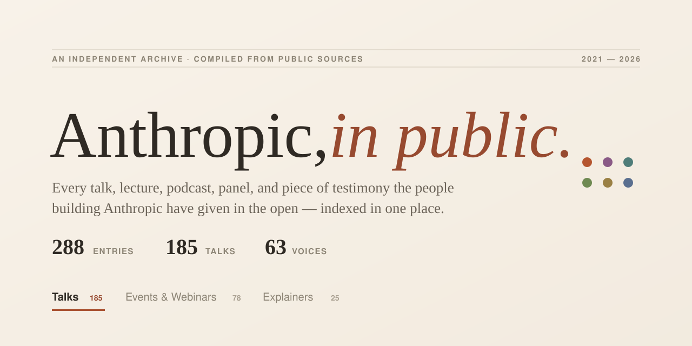

# Anthropic in Public

> An independent, chronological archive of the public talks, lectures, podcasts, panels, testimony, and essays given by the people building Anthropic — from the company's founding in 2021 to today.



> [!NOTE]
> **An open, non-commercial project, made for learning.** It is **not affiliated with, endorsed by, or sponsored by Anthropic**. "Anthropic" and "Claude" are trademarks of Anthropic PBC. Every entry links to publicly available third-party content owned by its respective creators and hosts.

A single-page, **zero-dependency** static site. No framework, no build step — just an HTML file and two data files. Every entry links to its original source.

---

## What's inside

**288 catalogued appearances** across three views:

| View | Count | What it is |
|------|-------|------------|
| **Talks** | 185 | Keynotes, podcasts, interviews, lectures, panels, firesides, testimony, essays, and demos by named team members |
| **Events & Webinars** | 78 | Official Anthropic events (AWS Summits, Builder Summits, Google Cloud Next, The Briefing) and webinars |
| **Explainers** | 25 | Official research/product explainer videos from Anthropic's YouTube channel |

Spanning **2021–2026** and **60+ distinct voices** — Dario & Daniela Amodei, Jack Clark, Jared Kaplan, Chris Olah, Amanda Askell, the interpretability and alignment teams, the Claude Code team, and more.

## Features

- **Editorial archive design** — warm, paper-toned, typographic. Built to be read, not skimmed.
- **Three scoped views** — each with its own stats, filters, and timeline.
- **Live search** (press <kbd>/</kbd>) across titles, people, and venues.
- **Faceted filtering** — by format (keynote, podcast, lecture, …) and by speaker.
- **Newest / oldest** sort, grouped along a year-by-year timeline.
- **Every link verified** — all 288 sources health-checked; entries open in a new tab.
- **Responsive** — genuinely re-laid-out for mobile, not just shrunk.
- **No tracking, no dependencies, no build.**

## Run locally

It's a static site — serve the folder with anything, or just open `index.html`.

```bash
# option 1: any static server
python3 -m http.server 8799
# → open http://localhost:8799

# option 2: just open the file
open index.html        # macOS
```

## Project structure

```
.
├── index.html          # the whole app — markup, styles, and logic
├── data/
│   ├── talks.js        # the 185 named talks  (const TALKS)
│   └── extras.js       # events, webinars, explainers  (const EXTRAS)
├── docs/
│   └── preview.svg     # social/preview banner
├── README.md
└── LICENSE
```

## Data model

Each entry is a plain object:

```js
{
  title:       "Dario Amodei — 'We are near the end of the exponential'",
  speaker:     "Dario Amodei",          // display string
  people:      ["Dario Amodei"],        // individuals, drives the speaker facet
  role:        "Co-founder & CEO",
  venue:       "Dwarkesh Podcast",
  date:        "2026-02-13",            // YYYY-MM-DD, YYYY-MM, or YYYY
  type:        "podcast",               // see types below
  url:         "https://…",             // canonical source
  description: "A second Dwarkesh interview on the RL scaling regime…"
}
```

**Types:** `keynote` · `podcast` · `interview` · `panel` · `lecture` · `testimony` · `fireside` · `workshop` · `essay` · `demo` — plus `event` · `webinar` · `explainer` (in `extras.js`, which also carry a `category` field).

## Adding or correcting an entry

1. Add an object to `data/talks.js` (or `data/extras.js`) — order doesn't matter; entries are sorted and grouped by date at runtime.
2. Use a **canonical, working URL** (the show's own page or the official upload — not an aggregator).
3. Reload. The timeline, counts, facets, and search update automatically.

## Sources & verification

Every entry was compiled from public sources and links to a primary one — a recording, transcript, podcast page, conference listing, or official document. Links were verified to resolve, and ambiguous or low-confidence items were dropped rather than guessed.

This is **unofficial** and **not affiliated with or endorsed by Anthropic**. All talks are the work of their respective speakers and hosts. If you spot a gap, a wrong date, or a stale link, open an issue or PR.

## License

Code: [MIT](LICENSE). The catalogued metadata points to third-party content owned by its respective creators and hosts.
